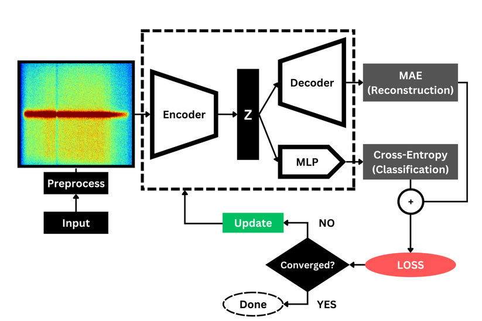
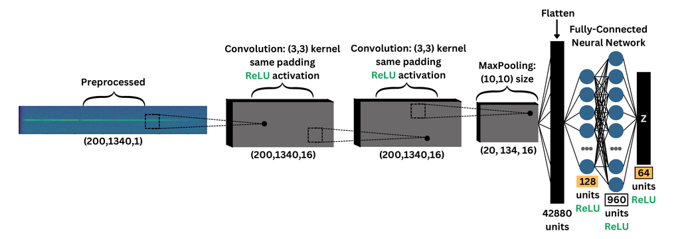
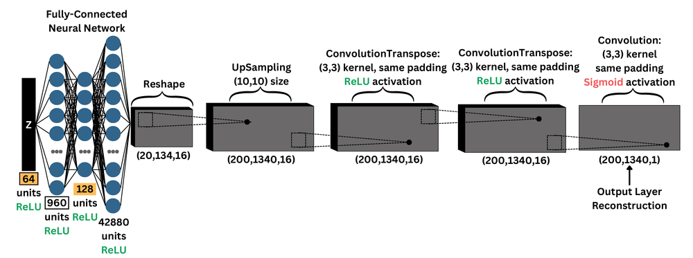
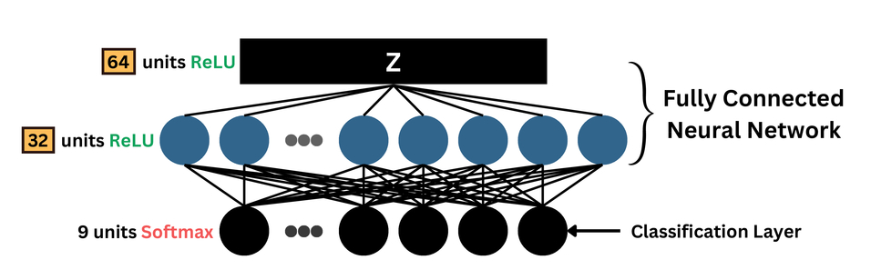

# Tri-Fun-Net: A Semi-Supervised Convolutional Autoencoder for Space Object Classification

This repository contains the implementation of Tri-Fun-Net, a semi-supervised deep learning architecture for classifying Unresolved Resident Space Objects (URSO) as presented in [SPIE Defense + Commercial Sensing 2024](https://doi.org/10.1117/12.3014277).

## Overview

Tri-Fun-Net is designed to combine a Convolutional Autoencoder (CAE) with a Multi-layer Perceptron (MLP) classifier.



```python
class CAE_CLASSIFIER(keras.Model):
    def __init__(self, encoder, decoder, classifier, **kwargs):
        super().__init__(**kwargs)
        # Sub-networks
        self.encoder = encoder
        self.decoder = decoder
        self.classifier = classifier

        # Initialize trackers
        self.total_loss_tracker = keras.metrics.Mean(name='total_loss')
        self.reconstruction_loss_tracker = keras.metrics.Mean(name='reconstruction_loss')
        self.classification_loss_tracker = keras.metrics.Mean(name='classification_loss')

        # Initialize accuracy
        self.accuracy_metric = keras.metrics.SparseCategoricalAccuracy(name='accuracy')

    @property
    def metrics(self):
        return [
            self.total_loss_tracker,
            self.reconstruction_loss_tracker,
            self.classification_loss_tracker,
            self.accuracy_metric,
        ]

    def call(self, inputs):
        # Forward pass through the model
        latent_z = self.encoder(inputs)
        reconstruction = self.decoder(latent_z)
        classification = self.classifier(latent_z)
        return (reconstruction, classification)

    def train_step(self, data):
        # Unpack data
        x_imgs, y_labels = data

        with tf.GradientTape() as tape:
            # Forward pass
            latent_z = self.encoder(x_imgs)
            reconstruction = self.decoder(latent_z)
            classification = self.classifier(latent_z)

            # Reconstruction loss (MAE)
            reconstruction_loss = tf.reduce_mean(
                tf.reduce_mean(tf.abs(x_imgs - reconstruction), axis=[1, 2])
            )

            # Classification loss (Cross-Entropy)
            classification_loss = tf.reduce_mean(
                tf.keras.losses.sparse_categorical_crossentropy(y_labels, classification)
            )

            # Combine losses
            total_loss = reconstruction_loss + classification_loss

            # Calculate accuracy
            self.accuracy_metric.update_state(y_labels, classification)

        # Backpropagation
        grads = tape.gradient(total_loss, self.trainable_weights)
        self.optimizer.apply_gradients(zip(grads, self.trainable_weights))

        # Update metrics
        self.total_loss_tracker.update_state(total_loss)
        self.reconstruction_loss_tracker.update_state(reconstruction_loss)
        self.classification_loss_tracker.update_state(classification_loss)

        # Return metrics
        return {
            'loss': self.total_loss_tracker.result(),
            'reconstruction_loss': self.reconstruction_loss_tracker.result(),
            'classification_loss': self.classification_loss_tracker.result(),
            'accuracy': self.accuracy_metric.result(),
        }
```

## Architecture Components

The network consists of three main components:

1. **Encoder**: Creates a shared latent space through dimensionality reduction

   

   ```python
    def define_encoder(latent_dim, input_shape):
        # Input
        encoder_inputs = keras.Input(shape=input_shape)

        # Encoder
        x = layers.Conv2D(filters=16, kernel_size=(3, 3), strides=1, padding='same', activation='relu')(encoder_inputs)
        x = layers.Conv2D(filters=16, kernel_size=(3, 3), strides=1, padding='same', activation='relu')(x)
        x = layers.MaxPooling2D(pool_size=(10, 10))(x)
        x = layers.Flatten()(x)
        x = layers.Dense(units=128, activation='relu')(x)
        x = layers.Dense(units=960, activation='relu', use_bias=False, kernel_regularizer=regularizers.OrthogonalRegularizer(factor=1.0))(x)

        # Encoder Output
        encoder_outputs = layers.Dense(units=latent_dim, activation='relu', use_bias=False, kernel_regularizer=regularizers.OrthogonalRegularizer(factor=1.0))(x)

        # Model
        encoder = keras.Model(encoder_inputs, encoder_outputs, name='encoder')
        return encoder
   ```

2. **Decoder**: Reconstructs input data from the latent space

   

   ```python
    def define_decoder(latent_dim):
        # Input
        decoder_inputs = keras.Input(shape=(latent_dim,))

        # Decoder
        x = layers.Dense(units=960, activation='relu', use_bias=False, kernel_regularizer=regularizers.OrthogonalRegularizer(factor=1.0))(decoder_inputs)
        x = layers.Dense(units=128, activation='relu')(x)
        x = layers.Dense(units=20*134*16, activation='relu')(x)
        x = layers.Reshape(target_shape=(20, 134, 16))(x)
        x = layers.UpSampling2D(size=(10, 10), interpolation='nearest')(x)
        x = layers.Conv2DTranspose(filters=16, kernel_size=(3, 3), strides=1, padding='same', activation='relu')(x)
        x = layers.Conv2DTranspose(filters=16, kernel_size=(3, 3), strides=1, padding='same', activation='relu')(x)

        # Decoder Output
        decoder_outputs = layers.Conv2D(filters=1, kernel_size=(3, 3), strides=1, padding='same', activation='sigmoid')(x)

        # Model
        decoder = keras.Model(decoder_inputs, decoder_outputs, name='decoder')
        return decoder
   ```

3. **MLP Classifier**: Performs classification using the encoded representations

   

   ```python
    def define_classifier(latent_dim, num_classes):
        # Input
        classifier_inputs = keras.Input(shape=(latent_dim,))

        # Classifier
        x = layers.Dense(units=32, activation='relu', use_bias=False, kernel_regularizer=regularizers.OrthogonalRegularizer(factor=1.0))(classifier_inputs)

        # Classifier Output
        classifier_outputs = layers.Dense(units=num_classes, activation='softmax')(x)

        # Model
        classifier = keras.Model(classifier_inputs, classifier_outputs, name='classifier')
        return classifier   
   ```

## Requirements

### Required Packages

- **numpy**
- **pandas**
- **scikit-learn**
- **scikit-image**
- **tensorflow**
- **keras**
- **matplotlib**
- **plotly**

## Training

```python
    # Model sub-networks
    encoder = define_encoder(latent_dim=LATENT_DIM, input_shape=x_train.shape[1:])
    decoder = define_decoder(latent_dim=LATENT_DIM)
    classifier = define_classifier(latent_dim=LATENT_DIM, num_classes=np.unique(y_train).shape[0])

    # Define model
    cae_classifier = CAE_CLASSIFIER(encoder, decoder, classifier)
    cae_classifier.compile(optimizer=keras.optimizers.SGD(learning_rate=LEARNING_RATE))

    # Train model
    history = cae_classifier.fit(
        x_train, y_train,
        epochs=EPOCHS,
        batch_size=BATCH_SIZE,
    )
```

## Citation

> **Cedillo, L. R., Acosta, K., Velez-Reyes, M., & DeBlasio, D.** (2024). *Using neural networks to classify hyperspectral signatures of unresolved resident space objects*. In **Algorithms, Technologies, and Applications for Multispectral and Hyperspectral Imaging XXX** (Vol. 13031, p. 130310B). SPIE. [https://doi.org/10.1117/12.3014277](https://doi.org/10.1117/12.3014277)

## Contributors

- Luis R. Cedillo - The University of Texas at El Paso
- Kevin Acosta - The University of Texas at El Paso
- Miguel Velez-Reyes - The University of Texas at El Paso
- Dan DeBlasio - Carnegie Mellon University

## Contact

Luis R. Cedillo - lcedillo@miners.utep.edu